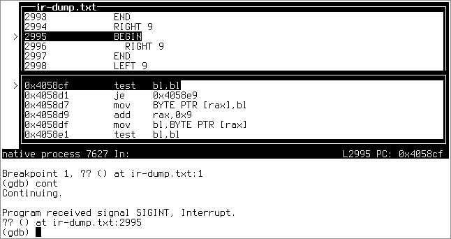

bfc
===

'bfc' is a small, fast, self-contained, optimizing Brainfuck compiler for *nix
on Intel x86-64.

Also included are several interpreters in various states of sophistication that
document my progress as I was writing this, from the simplest approach to an
optimizing JIT compiler.

It's pretty easy to retarget the compiler, it just means redoing half the work.
Thanks to the unified ABI, adding support for another flavour of *nix only means
changing the syscall numbers.  The compiler itself is platform agnostic.

Building
--------
Build dependencies: a C99 compiler +
Runtime dependencies: Linux or OpenBSD

 $ git clone https://github.com/pjanouch/bfc.git
 $ cd bfc
 $ make

To obtain dumps of the intermediate representation, compile with `-DDEBUG`:

 $ make CPPFLAGS=-DDEBUG

Usage
-----

 $ ./bfc-amd64-linux [INPUT-FILE] [OUTPUT-FILE]
 $ ./bfc-amd64-openbsd [INPUT-FILE] [OUTPUT-FILE]

When no input file is specified, standard input is used.  Similarly, the default
output filename is `a.out`.  After the compilation, the resulting file can be
run on the target platform.

DWARF
-----
You may have noticed the 'dwarf' directory.  `simple.go` is a non-optimizing
version of the compiler targeting Linux only that adds DWARF debugging
information mapping code locations onto lines in the `ir-dump.txt` byproduct
output file.  It's been rewritten in Go since managing all those binary buffers
required to build the symbol table proved to be too painful in C.

 $ go run dwarf/simple.go [INPUT-FILE] [OUTPUT-FILE]

Type `break *0x4000b7` into gdb to get a breakpoint at the first Brainfuck
instruction.

There is also `object-file.go` that generates an object file that can be
statically linked with `ld`, and `object-file-libc.go` that generates an
OS-independent binary that can be linked against the libc with the C compiler:

 $ go run dwarf/object-file-libc.go program.bf program.o
 $ cc program.o -o program

Contributing and Support
------------------------
Use this project's GitHub to report any bugs, request features, or submit pull
requests.  If you want to discuss this project, or maybe just hang out with
the developer, feel free to join me at irc://irc.janouch.name, channel #dev.

Bitcoin donations: 12r5uEWEgcHC46xd64tt3hHt9EUvYYDHe9

License
-------
'bfc' is written by Přemysl Janouch <p.janouch@gmail.com>.

You may use the software under the terms of the ISC license, the text of which
is included within the package, or, at your option, you may relicense the work
under the MIT or the Modified BSD License, as listed at the following site:

http://www.gnu.org/licenses/license-list.html
